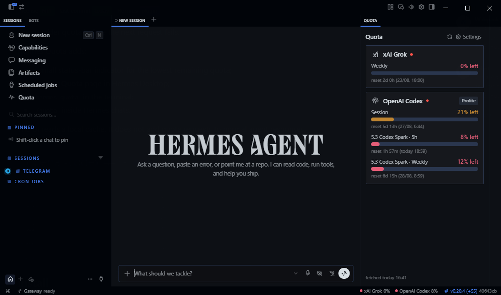

# Hermes Quota

Live quota indicator for Hermes Desktop — a **status-bar chip** and a **Quota
pane** in the sidebar, fed by `hermes quota status --json`. The UI never does
network I/O of its own; it reads a local cache the backend refreshes on demand.



## What you get

- **Status bar (bottom-right):** a compact chip with your lowest remaining
  quota. Hover it for a full breakdown of **every provider and every window**
  (Session, Spark 5h, Spark Weekly…) with `% left` and time-to-reset. Toggle
  between *worst only* and *all providers* in Settings.
- **Quota pane (sidebar):** one card per provider with the official brand
  icon, a tonal progress bar, the plan badge, and detail lines (credits,
  banked resets). Providers without data collapse into a quiet "No data"
  section — the default view shows only providers with live numbers.
- **Cherry-pick providers:** in Quota Settings, toggle any provider on or off.
  Your choice is local and persists.
- **CLI:** `hermes quota`, `hermes quota refresh`, `hermes quota status [--json]`,
  `hermes quota provider <name>`.

## Supported providers

`anthropic`, `openai-codex`, `nous`, `openrouter`, `gemini`, `kimi`,
`opencode-go`, `copilot`, plus `grok` (opt-in). Each fetcher is fail-open: a broken
provider shows `unavailable (<reason>)` and never blocks the rest.

The OpenAI Codex fetcher goes beyond the core: it parses
`additional_rate_limits` to surface **per-model Spark limits**
(`5.3 Codex Spark · 5h`, `5.3 Codex Spark · Weekly`) that would otherwise
stay hidden.

## Grok is opt-in

Grok is the only provider read from your browser — there is no clean API path
right now. It is **disabled by default**. Turn it on:

```bash
hermes config set plugins.entries.quota.settings.grokEnabled true
hermes quota refresh
```

When off, Grok reports `opt-in-disabled`. No cookies are read, no files written.

Cookie sources, in order:

1. `~/grok_session.json` if you created one yourself
2. Firefox `grok.com` cookies
3. Google Chrome `grok.com` cookies (macOS)

Chrome notes:

- Sign into https://grok.com in Chrome at least once.
- macOS will prompt for the `Chrome Safe Storage` Keychain item on first refresh.
- If refresh returns `chrome-tcc-denied`, grant Full Disk Access to **Hermes.app**
  (Desktop) and/or the Terminal you use for `hermes quota refresh`, then retry.
- Chrome 127+ cookies prefix a SHA256(`host_key`) digest before the value; that prefix is stripped after AES-CBC decrypt.
- Chrome App-Bound `v20` cookies are not supported (`chrome-app-bound`).
- Safari is not supported.

## Install

```bash
git clone https://github.com/rarf/hermes-quota-plugin.git
cd hermes-quota-plugin
./install.sh
```

One global backend + widget, enabled for every profile without touching other
plugins. Re-run anytime to update; `./uninstall.sh` removes it symmetrically.

### Multiple Hermes profiles

Hermes resolves plugins **per profile**: both the Python backend scanner
(`<profile>/plugins/`) and the Desktop widget loader
(`<profile>/desktop-plugins/`) read from the *active profile's* hermes home —
only the `default` profile uses the global `~/.hermes/` roots. A plugin
installed solely at the global root loads in `default` and shows
"backend unavailable" in every named profile.

`./install.sh` handles this for you: besides the global install it symlinks
`profiles/<name>/plugins/quota` and `profiles/<name>/desktop-plugins/quota`
into every existing profile, so all profiles share the single real copy —
re-running the installer after a `git pull` updates every profile at once.
`./uninstall.sh` removes those links (symlinks only; real directories you
created yourself are left untouched).

> **Restart Hermes Desktop completely** after install/update. Reloading plugins
> refreshes the widget only — the Python backend mounts at process start.
> Each profile's backend also needs its own first data collection: run
> `hermes quota refresh` once per profile (the quota cache is per-profile).

Verify:

```bash
hermes plugins doctor quota && hermes quota refresh && hermes quota status
# per-profile check (example):
HERMES_HOME=~/.hermes/profiles/guardian hermes plugins doctor quota
```

## Where the numbers come from

Providers with a CLI or OAuth login (anthropic, openai-codex, gemini, kimi CLI)
are read locally. Refresh runs the fetchers and writes `$HERMES_HOME/quota_cache.json`;
the widget reads that file via `host.request('cli.exec', ['quota','status','--json'])`.

> The usage APIs expose only `used_percent` and `reset_at` per window — not an
> absolute cap. The plugin shows remaining **%** and **time-to-reset**, not a
> token or dollar count.

## Privacy & safety

- No telemetry. Cookies and tokens are never printed.
- Grok cookies are used only for the Grok billing request, and only when you opt in.
- Chrome/Firefox cookie values are never printed, cached, or written back to disk.
- Missing credentials produce an explicit `unavailable` state — no fake zeros.
- The plugin does not request permission to override built-in Hermes tools.

## Development

```bash
bash -n install.sh uninstall.sh
python -m py_compile __init__.py commands.py quota_cache.py quota_providers/*.py
python tests/test_fetchers.py
python tests/test_browser_cookies.py
node --check desktop/plugin.js
hermes plugins doctor quota
hermes quota refresh
```

To add a provider, write a fetcher in `quota_providers/` that returns a
`QuotaResult` and register it. The cache and widget need no provider-specific changes.

MIT.
