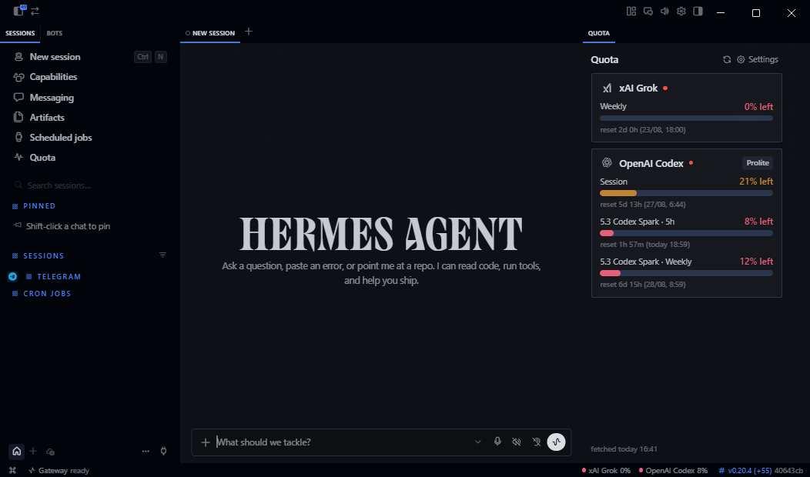

# Hermes Quota

Per-provider quota and rate limits, live in Hermes Desktop — a **status-bar chip**,
a **docked pane**, a **`/quota` page** and a **CLI**, all fed by a local cache so
the UI never does network I/O of its own.


The pane docks on the right of Hermes Desktop; the chip sits in the status bar at
the bottom, next to the client/backend version label:

**Contents** — [Install](#install) · [What you get](#what-you-get) ·
[Providers](#providers) · [How it works](#how-it-works) ·
[Troubleshooting](#troubleshooting) · [Privacy](#privacy--safety) ·
[Development](#development) · [Acknowledgements](#acknowledgements)

## Install

```bash
git clone https://github.com/rarf/hermes-quota-plugin.git
cd hermes-quota-plugin
./install.sh
```

One global backend + widget, enabled for every profile without touching other
plugins. Re-run it anytime to update; `./uninstall.sh` removes it symmetrically.

> **Restart Hermes Desktop completely** after installing or updating. Reloading
> desktop plugins refreshes the *widget* only — the Python backend mounts at
> process start. Each profile also needs its own first collection: run
> `hermes quota refresh` once per profile (the cache is per-profile).

Verify:

```bash
hermes plugins doctor quota && hermes quota refresh && hermes quota status
# per-profile check (example):
HERMES_HOME=~/.hermes/profiles/guardian hermes plugins doctor quota
```

### Multiple profiles

Hermes resolves plugins **per profile**: both the Python backend scanner
(`<profile>/plugins/`) and the Desktop widget loader
(`<profile>/desktop-plugins/`) read from the *active profile's* hermes home —
only `default` uses the global `~/.hermes/` roots. A plugin installed solely at
the global root loads in `default` and shows "backend unavailable" in every named
profile.

`./install.sh` handles this: besides the global install it symlinks
`profiles/<name>/plugins/quota` and `profiles/<name>/desktop-plugins/quota` into
every existing profile, so all profiles share one real copy — re-running the
installer after a `git pull` updates every profile at once. `./uninstall.sh`
removes those links (symlinks only; real directories you created yourself are
left untouched).

### Remote app: the widget and the backend are two different machines

The widget file is read from the machine **running the app**
(`<HERMES_HOME>/desktop-plugins/quota/plugin.js`, resolved by Electron), while
`quota status` / `quota refresh` run on the **gateway** the app is connected to.
Updating the backend and updating the widget are therefore two separate steps —
a stale widget shows fresh numbers with old names or icons. A build mismatch is
called out in the pane (see [Troubleshooting](#troubleshooting)).

### Updating

How the plugin updates depends on how it was installed.

**From this repo** (`git clone` + `./install.sh`): `git pull`, then re-run
`./install.sh`. It refreshes the backend, the widget and the per-profile
links, and stamps the new build so the update banner settles.

**Through the Hermes plugin catalog** (`hermes plugins install quota`):
Hermes pins the install to the commit recorded in its catalog entry, and
`hermes plugins update quota` — or the update action in Settings — moves it
only to that pin. While the pin trails this repo, the pane can show
*Update available* (the banner compares the installed build against the
default branch) even though Hermes reports the install **is already at
catalog pin**. To move ahead of the catalog, reinstall at the desired commit:

```bash
hermes plugins install quota --ref <commit> --force --enable
```

Hermes does not write the build stamp into a catalog-managed install. Add
`version.json` in the plugin directory (`~/.hermes/plugins/quota/`, alongside
`plugin.yaml`) so the pane's update check can tell which build is installed —
without a stamp the check stays silent:

```json
{ "installed_sha": "<commit>", "installed_at": "<ISO-8601 UTC>" }
```

The stamp is not refreshed for you: an untracked `version.json` survives a catalog
update (untracked files are carried into the replacement tree) and the `--ref`
reinstall above, so it keeps describing the build it was written for. After any
update, rewrite it — or delete it — with the commit now installed, otherwise the
pane advertises an update the install already has.

Either path updates the backend only. On a remote app the widget is a
separate file on the app machine — update it too and reload desktop plugins.

## What you get

### Status-bar chip

- Compact chip with your **lowest remaining quota**, or every provider side by
  side (`Status bar mode`).
- Hover for the full breakdown: **every provider and every window** (Session,
  Spark 5h, Spark Weekly…) with `% left` and time-to-reset.

### Quota pane

Reachable three ways: the **docked pane** (`Placement: right`, 300px, toggled in
Settings), the **`/quota` route** and the **sidebar nav row** (`Quota`, pulse
icon).



- One card per provider with the official brand icon, a tonal progress bar, the
  plan badge and per-window rows.
- Detail lines where the API offers them: credits, banked resets, extra limits.
- Providers without data collapse into a quiet **"No data (n)"** section — the
  default view shows only providers with live numbers.
- **Pane detail**: `clean` (percentage windows and balance headlines) or `dense`
  (every window, reset time and detail line). Dense is the default.
- Footer: `Checked Jan 15, 2025, 12:34:56 PM UTC · 46s old · poll 60s`,
  localized with the full date, seconds and timezone. Provider cards scroll
  separately so long balance details cannot overlap the footer.
- Notices when something is off: an **update available** banner (checked against
  the installed build) and a **version-skew** notice when the widget and the
  backend are not the same build.

### Settings

Everything lives in the pane's **Quota Settings** view and persists locally:

| Setting | Values | Default |
| --- | --- | --- |
| Status bar mode | `all providers` · `worst only` | `all providers` |
| Show status bar indicator | on · off (the Hermes status bar must also be visible: ⌘K → Toggle status bar) | on |
| Pane detail | `clean` — just the percentage bars · `dense` — windows, resets and detail lines | `dense` |
| Reset format | `relative` (`2h 15m (14:30)`) · `absolute` (`14:30`) | `relative` |
| Refresh interval | 15–600 s | `60` |
| Enabled providers | toggle any provider on/off (cherry-pick) | all on |
| Show docked quota pane | on · off | on |

### Commands

| Command | What it does |
| --- | --- |
| `/quota` | Show the current table in chat (refreshes first if stale) |
| `hermes quota` | Same as `hermes quota status` |
| `hermes quota status` | Table of every enabled provider |
| `hermes quota status --json` | Raw payload for the desktop widget |
| `hermes quota status --json --cached` | The cache as-is — never refreshes (widget poll path) |
| `hermes quota status --max-age N` | Refresh first when the cache is older than N seconds |
| `hermes quota status --version-json` | Installed build stamp (update self-check) |
| `hermes quota refresh` | Force a re-fetch of all providers |
| `hermes quota provider <name>` | One provider, e.g. `hermes quota provider anthropic` |
| `hermes quota <provider-id>` | Shortcut, e.g. `hermes quota grok` |

## Providers

| Provider | Source | Notes |
| --- | --- | --- |
| `anthropic` | Anthropic OAuth usage API | One bounded read maps session/weekly windows, model-scoped weekly limits such as **Fable week**, and extra usage |
| `openai-codex` | local OAuth | Also parses `additional_rate_limits` to surface **per-model Spark limits** (`5.3 Codex Spark · 5h`, `· Weekly`) that stay hidden elsewhere |
| `copilot` | local OAuth | Plan badge + windows |
| `nous` | Nous Portal | Works on free accounts |
| `gemini` | local CLI / OAuth | Detects the tier via `loadCodeAssist` |
| `antigravity` | Reads `gemini:antigravity` from Windows Credential Manager; the `gemini` / `antigravity` item from macOS Keychain; or `~/.gemini/antigravity-cli/antigravity-oauth-token` on Linux | **Opt-in, disabled by default.** Google AI Pro pools — Gemini and Claude/GPT each with a 5-hour and a weekly window; plan from `loadCodeAssist` (`paidTier` wins over `currentTier`). When enabled, refreshes with Antigravity's installed-app OAuth client identity and impersonates its `User-Agent: antigravity/2.8.0 windows/amd64`. Credential stores are read-only. |
| `kimi` | Hermes `kimi-coding` auth (dotenv/pool) or `~/kimi_session.json` | Session (5h), Monthly, and rate windows from `api.kimi.com/coding/v1/usages` |
| `openrouter` | Hermes native API key + saved credential pool | Per-key caps/usage and one explicitly scoped account wallet; see below |
| `deepseek` | Native DeepSeek API key | Account balances in USD/CNY and API-call availability, no fabricated percentage |
| `opencode-go` | API key | See the OpenCode note below |
| `zai` | Z.ai API key | GLM Coding Plan Session, Weekly and web-tools windows |
| `commandcode` | Command Code CLI `~/.commandcode/auth.json`, then Hermes `commandcode` API-key auth | 5h, Weekly, and a known-plan Cycle window |
| `cursor` | `cursor-agent` login (macOS keychain or `auth.json`) | Read-only credential use; Included and API billing-cycle percents; personal on-demand cap as a window, personal/team pools as details. If the session expires, run `cursor-agent login`; the plugin never exchanges refresh tokens or writes to Cursor's credential store. |
| `minimax` | Subscription Key **or** OAuth (`minimax-oauth`) | Token Plan 5h + Weekly windows per model; pay-as-you-go keys show `no-subscription`. The `video` model bucket is **opt-in** (default off — low tiers don't include video, so the entry reports a meaningless 100%). Enable with `hermes config set plugins.entries.quota.settings.minimaxVideoEnabled true` or `HERMES_QUOTA_MINIMAX_VIDEO_ENABLED=1`. |
| `grok` | browser cookies | **Opt-in**, disabled by default |

Each fetcher is **fail-open**: a broken provider shows `unavailable (<reason>)`
and never blocks the rest.

### Antigravity

Antigravity quota collection is disabled unless you opt in:

```sh
hermes config set plugins.entries.quota.settings.antigravityEnabled true
```

Alternatively, set `HERMES_QUOTA_ANTIGRAVITY_ENABLED=1`. If enabled, the plugin
reads Antigravity's token from Windows Credential Manager (`gemini:antigravity`),
macOS Keychain (service `gemini`, account `antigravity`), or Linux's
`~/.gemini/antigravity-cli/antigravity-oauth-token` file. It refreshes the token
with Antigravity's installed-app OAuth client identity, then calls Google's
quota service using the spoofed `User-Agent: antigravity/2.8.0 windows/amd64`.
Credential stores are read-only; refreshed tokens stay in memory.

### DeepSeek

Reads the documented [`GET /user/balance`](https://api-docs.deepseek.com/api/get-user-balance)
endpoint at `https://api.deepseek.com`. Credentials come from Hermes' native
`resolve_api_key_provider_credentials("deepseek")` helper, including its dotenv
and `key_env` precedence. Configure `DEEPSEEK_API_KEY` through Hermes as usual.
The plugin does not enumerate, rotate, or write credential pools.

This is the direct DeepSeek account balance, not usage of DeepSeek models through
OpenRouter. Each returned USD/CNY balance stays separate, with total, granted and
topped-up amounts preserved as decimal strings in the cache. No account balances
are added together, no per-key spending limit is inferred, and no plan or quota
percentage is invented. Zero balances and `is_available: false` are valid data.

The pane shows a balance headline and API-call availability in both clean and
dense modes. Dense mode and `/quota deepseek` also show the detailed breakdown.
The status-bar chip displays money instead of an empty percentage; worst-only
mode uses balance chips only when no percentage windows are available.
Missing credentials and failed requests remain explicit unavailable states.
Requests have a timeout, bounded response size, and no redirects; error details
and credentials are never written into the display cache.
### OpenRouter

Reads `GET https://openrouter.ai/api/v1/key` separately for each distinct locally
configured credential, using Hermes' native OpenRouter resolution plus its saved
credential pool. Duplicate secrets are queried once even if their saved labels
differ. Native resolution is pinned to the canonical OpenRouter endpoint to
avoid selecting, rotating or seeding the runtime pool. Environment-backed saved
rows are resolved through Hermes' profile-aware credential lookup. This is not
an inventory of all keys on an OpenRouter account: the management `/keys`
endpoint is never queried, and no management key is required.

Each key has a generated label such as `Key 1 (native)` or `Key 2 (saved)`.
Saved/vendor labels, key suffixes, hashes, account IDs and emails are never
included in display data. The ordinal follows discovery order, not a stable
account identity or the runtime pool's current selection.

- Key-specific spending cap, remaining allowance and daily/weekly/monthly usage
  are shown when supplied by the API. A percentage requires a positive cap and
  remaining allowance within that cap. An uncapped key does not mean unlimited
  account credit; an exhausted key cap does not mean an empty account wallet.
- `/credits` is queried **once**, through the native credential (or the first
  resolved saved credential if native resolution is unavailable). The displayed
  wallet belongs to that credential's account. Other keys' account membership is
  **unverified**: wallets are never summed, duplicated or inferred from equal
  balances. The wallet is not a total across accounts.
- Key and wallet requests run independently under one 10-second deadline. One
  failed or timed-out key does not hide successful keys or the wallet. If every
  request fails, the provider is unavailable rather than reporting false data.
- The Desktop pane retains these details in **both clean and dense modes**, so
  wallet scope, uncapped keys and per-key failures remain visible. They are also
  present in `hermes quota status --json`.

### CommandCode

CommandCode prefers the API key from `~/.commandcode/auth.json`. When that
file has no usable key, it uses Hermes' `commandcode` API-key resolver (including
Hermes dotenv and credential-pool sources). It follows the billing calls used
by the official Command Code CLI 1.53.0. It first requests
`/alpha/whoami?limits=1`, then scopes billing and usage calls with the returned
organization ID; `currentPeriodStart` is passed as the usage-summary `since`
value when the subscription response provides it. These alpha routes are not a
public API, so the fetcher fails open on unknown response shapes and shows only
known plan labels/denominators. It accepts both observed locations for
`windowLimits` (`credits.windowLimits` and the older top-level form), shows
rolling **5h** and **Weekly** windows, and shows a **Cycle** percentage only for
a known plan. Unknown plans retain a balance-only detail instead of an invented
label or percentage. The provider's request group has its own 10-second
wall-clock deadline, below the cache sweep budget.

### OpenCode (Go)

Reads `GET https://opencode.ai/zen/go/v1/usage`. The key is resolved from
`OPENCODE_API_KEY`, then `OPENCODE_GO_API_KEY` (the name Hermes' own `opencode-go`
chat provider uses in `~/.hermes/.env`), then OpenCode's CLI auth file
`~/.local/share/opencode/auth.json`. That endpoint intermittently answers
`503 Go usage is unavailable` for a large share of calls regardless of credential
or User-Agent, so the fetcher retries before reporting the provider unavailable.

### Grok (opt-in)

Grok is the only provider read from your browser — there is no clean API path
right now — so it is **disabled by default**:

```bash
hermes config set plugins.entries.quota.settings.grokEnabled true
hermes quota refresh
```

When off, Grok reports `opt-in-disabled`: no cookies are read, no files written.
Cookie sources, in order:

1. `~/grok_session.json` if you created one yourself
2. Firefox `grok.com` cookies
3. Chromium / Google Chrome / Brave `grok.com` cookies (macOS and Linux)

Browser notes:

- Sign into <https://grok.com> in the browser at least once.
- macOS reads the `Chrome Safe Storage` Keychain item (prompted on first
  refresh) and derives the AES key with 1003 PBKDF2 rounds.
- Linux reads the login keyring with
  `secret-tool lookup application chromium` (or `chrome` / `brave`, matching the
  profile that owns the cookie DB) and derives with a single PBKDF2 round —
  profiles created with `--password-store=basic` fall back to the well-known
  `peanuts` password.
- If refresh returns `chrome-tcc-denied`, grant Full Disk Access to
  **Hermes.app** (Desktop) and/or the Terminal you use for `hermes quota refresh`,
  then retry.
- Chromium 127+ cookies prefix a SHA256(`host_key`) digest before the value; that
  prefix is stripped after AES-CBC decrypt.
- App-Bound `v20` cookies are not supported (`chrome-app-bound`).
- Safari is not supported.

## How it works

Providers with a CLI or OAuth login (`anthropic`, `openai-codex`, `gemini`, `kimi`)
are read locally. A refresh runs the fetchers and writes
`$HERMES_HOME/quota_cache.json`; the UI only ever reads that file.

The desktop widget polls in two phases, so the configured interval is the real
cadence: every `refreshInterval` seconds it reads the cache with
`hermes quota status --json --cached` (no network, no waiting) and, when that
payload is older than the interval, fires `hermes quota refresh` out-of-band and
redraws when it lands. The sweep itself runs every provider **concurrently**
under a wall-clock budget (`REFRESH_BUDGET_S`, 20s), so one slow or hung endpoint
cannot stretch a poll past its interval — it is recorded as `timeout` and drops
its previous value until a refresh succeeds. The last payload is cached in the widget's storage too, so a
plugin reload or a gateway switch paints immediately instead of waiting on a
backend spawn.

> Quota windows show remaining **%** and **time-to-reset** when the API exposes
> a percentage or denominator. Account balances, such as DeepSeek, are separate
> monetary facts, never converted into a quota percentage.

## Troubleshooting

| Symptom | Cause | Fix |
| --- | --- | --- |
| "backend unavailable" in a named profile | Plugin installed only at the global root | Re-run `./install.sh` (it links every profile), then restart |
| Old provider names or icons | The widget on the app machine is an older build than the backend | Update the widget copy there and reload desktop plugins; restart for backend changes |
| Notice: *Widget vX · backend vY* | The two halves are different builds | Reload desktop plugins; restart the app if the backend is the older one |
| *Update available* banner while `hermes plugins update` reports **already at catalog pin** | The install is Hermes-managed and pinned to the catalog entry's commit; the banner compares the installed build against the default branch | Update past the pin as described under [Updating](#updating), or wait for the catalog entry to advance |
| `unavailable (opt-in-disabled)` for grok | Grok is opt-in | `hermes config set plugins.entries.quota.settings.grokEnabled true` |
| `unavailable (timeout)` after a refresh | A provider endpoint hung past the sweep budget | It drops its previous value until a refresh succeeds; check the provider's status page |
| `unavailable (503 …)` for opencode-go | Upstream flakiness, not your key | The fetcher already retries; it recovers on a later poll |
| Numbers not changing | Check the pane footer: `· <age> old · poll <N>s` | If the age grows past the interval, report it — the poll should be exact |
| `chrome-tcc-denied` / `chrome-keychain-denied` | macOS privacy prompts | Grant Full Disk Access / approve the Keychain item, then retry |
| `chrome-decrypt-failed` on Linux | Keyring locked or profile belongs to another browser | Unlock the login keyring, or check the profile is Chromium/Chrome/Brave |
| `chrome-app-bound` | App-Bound `v20` cookies | Not supported; use Firefox or `~/grok_session.json` |
| `chrome-crypto-missing` | Missing dependency | Install the `cryptography` package |

Typed failure reasons surfaced by a refresh: `chrome-tcc-denied`,
`chrome-keychain-denied`, `chrome-app-bound`, `chrome-unknown-prefix`
(unrecognized cookie format), `chrome-decrypt-failed`, `chrome-crypto-missing`.

## Privacy & safety

- No telemetry. Cookies and tokens are never printed.
- Grok cookies are used only for the Grok billing request, and only when you opt in.
- Chrome/Firefox cookie values are never printed, cached, or written back to disk.
- Missing credentials produce an explicit `unavailable` state — no fake zeros.
- The plugin does not request permission to override built-in Hermes tools.

## Development

```bash
bash -n install.sh uninstall.sh
python -m py_compile __init__.py commands.py quota_cache.py quota_providers/*.py
python -m unittest discover -s tests -p "test_*.py"
node --check desktop/plugin.js
hermes plugins doctor quota
hermes quota refresh
```

Widget changes can be checked without launching the app — the harness renders the
real `desktop/plugin.js` against a real payload and asserts the pane's contract
(provider names, brand mark, footer cadence):

```bash
npm i --no-save react react-dom @babel/core @babel/preset-react @babel/preset-env
hermes quota status --json --cached > .widget-fixture.json
node scripts/render-widget.cjs                        # pane
AREA=statusbar.right node scripts/render-widget.cjs   # status bar chip
```

The offline widget render tests require Node.js (no npm dependencies). They
execute the actual widget with SDK hooks stubbed and a fixed locale/timezone.
For optional real Chromium geometry tests, see [widget layout tests](docs/widget-balance-layout.md).

To add a provider, write a fetcher in `quota_providers/` that returns a
`QuotaResult` and register it. The cache and the widget need no
provider-specific changes.

## Acknowledgements

Community work integrated into this plugin, with thanks:

- [@d31tcjg](https://github.com/d31tcjg) for Chrome cookie import for the Grok
  provider (#2)
- [@tdoan35](https://github.com/tdoan35) for the Z.ai Coding Plan provider, the
  gateway-diagnostics JSON fix and the Codex usage-URL helper fix (#12, #13, #14)
- [@Hyp4tia](https://github.com/Hyp4tia) for the CommandCode provider (#15)
- [@mredodos](https://github.com/mredodos) for resolving Hermes-managed
  credentials and honest unavailable reasons for Kimi and Anthropic (#19)
- [@donovan-yohan](https://github.com/donovan-yohan) for the Cursor provider and
  Anthropic's model-scoped weekly limits (#20, #21)
- [@jfjauvin](https://github.com/jfjauvin) for routing quota commands to the
  focused profile (#26)
- [@spiwar](https://github.com/spiwar) for the Antigravity provider and its
  bucket semantics (#25, landed in #31)
- [@lanx214](https://github.com/lanx214) for the CommandCode credential report
  and the live re-validation that cleared it (#27)
- [@zaydiscold](https://github.com/zaydiscold) for DeepSeek account balances
  with the pane's balance layout, and OpenRouter per-key quotas with a scoped
  account wallet (#23, #24)
- [@thileman](https://github.com/thileman) for the MiniMax Token Plan fetcher
  (#29, #30)

MIT.
